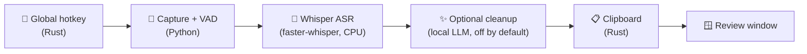

<div align="center">

# 🎙️ Local Voice

**Offline, privacy-first dictation for the desktop.**
Press a hotkey, speak, and get clean text — pasted anywhere, on any app, with nothing ever leaving your machine.

[](engine/)
[](desktop/)
[](ui/)
[](engine/)
[](engine/app/adapters/speech/)
[](LICENSE)
[](https://github.com/bhairavaa/local-voice/actions/workflows/ci.yml)

</div>

---

## What it does

1. **Press `Ctrl+Alt+Space`** — from any application, no need to switch focus
2. **Speak** — a small "Listening" indicator appears, without stealing keyboard focus
3. **Press it again** (or just pause) — recording stops on its own
4. Speech is transcribed **entirely on-device** by Whisper, cleaned up, and the result is on your **clipboard before the window even appears**
5. **Paste** — anywhere: ChatGPT, an editor, an email, a terminal

No cloud API. No account. No telemetry. The only network call in the product's lifetime is the one-time model download.

---

## Demo


https://github.com/user-attachments/assets/5c779008-4be2-4a14-9e7b-8239402a28d6


---



---

## Why this project exists

Every mainstream dictation tool — Windows Voice Typing, Wispr Flow, cloud Whisper APIs — sends your voice to a server. For an engineer dictating prompts, private notes, or proprietary code discussions into an AI assistant, that's not acceptable. This is a from-scratch answer to "what would a dictation tool look like if privacy were a hard constraint, not a feature checkbox?"

That constraint shaped real engineering decisions, not just marketing copy:

- The engine **refuses to bind to any non-loopback host** — enforced by a Pydantic validator, not a comment
- Every HTTP route requires a **per-session bearer token**, minted at launch and never persisted
- Transcribed speech is wrapped in a `Sensitive[T]` type that **redacts itself in logs by default** — revealing it requires an explicit opt-in *and* debug-level logging, so a careless log-level change can never start leaking what the user said
- The optional local-LLM cleanup step **cannot be pointed off-machine** — the config validator rejects any non-loopback URL outright

---

## Architecture

Two processes, each doing what its language is actually good at — not a monolith split for its own sake:

| | Rust (Tauri shell) | Python (engine) |
|---|---|---|
| **Owns** | Global hotkeys, clipboard, tray, window focus | Audio capture, VAD, Whisper, text cleanup |
| **Why not the other way** | A Python keyboard hook needs elevation on Windows and gets flagged by antivirus as a keylogger | The mature audio/ML ecosystem is Python's, not Rust's |

They communicate over **authenticated HTTP on loopback** — the engine publishes an ephemeral port and a session token as a single JSON line on startup; the Rust shell reads it, and the React UI talks to it through a client **generated directly from the engine's own OpenAPI schema**, so the two languages cannot silently drift out of sync.

```
desktop/   Tauri v2 shell (Rust)     — hotkeys, tray, clipboard, engine supervision
engine/    FastAPI sidecar (Python)  — audio → VAD → Whisper → optional LLM cleanup
ui/        React 19 + TypeScript     — the review window, typed against the engine's schema
schema/    openapi.json              — the contract between Python and TypeScript
```

Full design rationale: [`docs/Architecture.md`](docs/Architecture.md) · directory layout: [`docs/ProjectStructure.md`](docs/ProjectStructure.md)

---

## Engineering highlights

A few problems that only surfaced by *actually running the system end-to-end* — not from static analysis alone — and how they were diagnosed and fixed:

<details>
<summary><strong>🔍 A silent 16:1 recording bug, found by comparing two numbers in a log line</strong></summary>

<br>

Early voice-activity detection used a fixed energy threshold. On a real microphone in a real room, one dictation captured **28 seconds of audio for 1.7 seconds of actual speech** — background noise kept resetting the silence timer. Root-caused by comparing `captured_seconds` against `speech_seconds` in the structured logs, then fixed with:
- **Noise-floor calibration** — the first 0.4s measures the room and sets the threshold above it
- **Confirmation over consecutive blocks** — a single loud block (a keystroke, a door) no longer counts as speech
- **Hysteresis** — strict to *start* an utterance, forgiving to *continue* one, because raw speech energy swings hard between syllables

Verified against real speech until the ratio dropped to **~1.2:1**.
</details>

<details>
<summary><strong>⚡ A performance assumption that was backwards — fixed by measuring, not reasoning</strong></summary>

<br>

CPU thread count was capped at 4, on the theory that a hybrid Intel CPU's efficiency cores would slow inference down. That assumption was never benchmarked — and turned out to be **backwards by 4.6×**:

| threads | 2 | 4 | 6 | **8** | 12 |
|---|---|---|---|---|---|
| realtime factor | 0.54 | 0.51 | 0.45 | **0.11** | 0.10 |

Removed the cap; wrote a `laa-benchmark` CLI so future performance claims are measured, not assumed.
</details>

<details>
<summary><strong>🌐 "Engine unavailable" while the engine was demonstrably healthy</strong></summary>

<br>

`curl` and direct API calls both talked to the engine successfully — but the desktop UI reported `Failed to fetch`. The engine and the webview are **different origins**, so the browser silently preflighted every authenticated request; FastAPI had no CORS middleware to answer it. Invisible to a direct ASGI test client (bypasses the browser entirely) and to `curl` (ignores CORS). Only running the real application in the real webview exposed it — the exact argument for integration testing over unit tests alone.
</details>

<details>
<summary><strong>🔒 An accidental network call that broke the product's core privacy promise</strong></summary>

<br>

Every engine startup made an outbound request to Hugging Face to check the cached model's revision — a **16-second delay** and a violation of "no network access after setup." Found by comparing two adjacent log timestamps. Fixed with an offline-first load: try cached weights locally, fall back to a download only if genuinely absent. Startup time: **18s → 2s**, and the privacy claim in this README is now actually true rather than aspirational.
</details>

---

## Tech stack

| Layer | Technology |
|---|---|
| Desktop shell | Rust, Tauri v2, global-shortcut / clipboard-manager / single-instance plugins |
| Engine | Python 3.12, FastAPI, Pydantic v2, uvicorn, asyncio |
| Speech recognition | faster-whisper (CTranslate2), int8 quantized, CPU-only |
| Text cleanup (optional) | Local LLM via Ollama, loopback-only, faithfulness-checked output |
| Interface | React 19, TypeScript, Tailwind CSS v4, Vite |
| Contract | OpenAPI, codegen'd to TypeScript — one source of truth for both languages |
| Tooling | `uv`, `ruff`, `mypy --strict`, `clippy`, `eslint`, GitHub Actions |

---

## Try it

```powershell
git clone https://github.com/bhairavaa/local-voice.git
cd local-voice/engine
uv sync
uv run laa-dictate
```

Speak, pause, and the transcript prints. First run downloads the speech model (~480 MB); every run after that is fully offline.

For the full desktop experience (global hotkey, tray, clipboard):

```powershell
cd ../desktop
cargo tauri dev
```

Full setup, including the Windows toolchain requirements: [`docs/DeveloperGuide.md`](docs/DeveloperGuide.md)

---

## Design principles

- **Privacy is a property of the code, not a promise.** The loopback restriction, the token
  gate, and transcript redaction are all enforced mechanically, not just asserted.
- **Offline first.** The application works identically with the network disconnected, and
  makes no outbound request once the model is cached.
- **Built for modest hardware.** The reference machine is a CPU-only laptop with integrated
  graphics. CTranslate2 has no Intel GPU backend, so CPU performance is the target, not a
  fallback. The default model was chosen by measurement on that machine, not by guesswork —
  `uv run laa-benchmark` reproduces it.
- **Nothing is added to your words.** The default text pass fixes punctuation, casing, and
  grammar; it is not permitted to invent content. A rewrite whose length shows the model
  summarised or answered the dictation is discarded and the raw transcript kept instead.
  Expanding a prompt is a separate, opt-in profile.
- **English only.** Deliberately. The English-specialised Whisper models are smaller and more
  accurate than the multilingual ones at the same size, so the others are not offered.

---

## Project status

| Capability | State |
|---|---|
| Offline speech-to-text pipeline | ✅ Working, verified against real speech |
| Global hotkey, clipboard, tray | ✅ Working, verified end-to-end |
| Adaptive noise/endpointing | ✅ Working, tuned against a real microphone |
| CI (lint, type-check, schema-drift check) | ✅ Configured |
| Packaged installer (MSI/NSIS) | 🚧 In progress — sidecar bundling not yet solved |
| Settings UI | 🚧 Config layer exists; no screen yet |

This is an actively evolving personal project, not a finished shrink-wrapped product — see [`docs/Architecture.md`](docs/Architecture.md) for what's deliberately deferred and why.

---

## Documentation

- [Architecture](docs/Architecture.md)
- [Project structure](docs/ProjectStructure.md)
- [Developer guide](docs/DeveloperGuide.md)

## License

[MIT](LICENSE)
